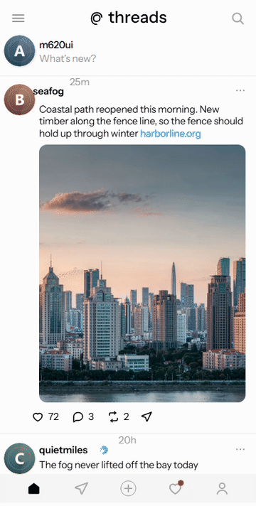
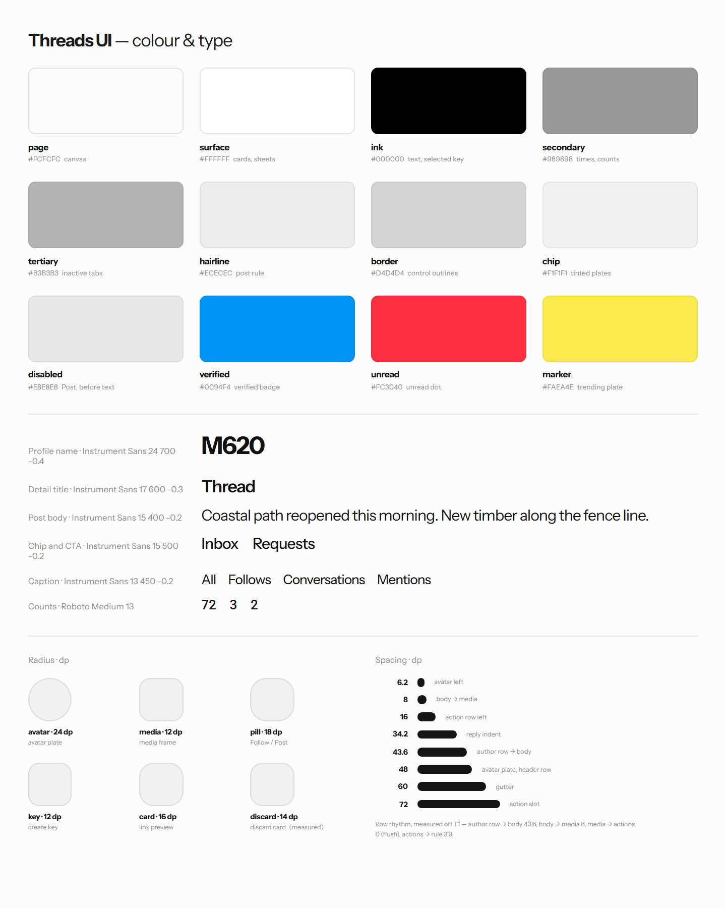

<p align="center">
  <a href="https://threads-ui.edgeone.cool"></a>
</p>

<h1 align="center">Threads UI</h1>

<p align="center">
  <a href="https://threads-ui.edgeone.cool"></a>
</p>

<p align="center">
  A high-fidelity, interactive recreation of the Threads Android app — real components, real navigation and local state, running in your browser.<br>
  <a href="DESIGN.md">DESIGN.md</a> · <a href="#design-notes">Design notes</a> · <a href="#explore-the-prototype">Explore</a> · <a href="#run-locally">Run locally</a> · <a href="#scope-and-limitations">Scope</a> · <a href="https://github.com/migrant620/awesome-app-design-md">More apps →</a>
</p>

---

Created to explore how Threads turns a single column of short text posts into a product that feels calm — a near-white canvas, one black ink, a hairline between posts and almost no colour anywhere. For the real experience of the social network itself, explore [Threads](https://www.threads.com).

Everything runs locally in your browser; it does not connect to a Threads or Instagram account and loads no live data.

## Design notes

What makes Threads' interface work, and what this recreation had to get right.

**One canvas, one ink.** The canvas is `#FCFCFC` rather than pure white, text is a single `#000000`, and posts are closed by a 1 px `#ECECEC` hairline instead of a card. In a text-first product the greyscale *is* the navigation: once posts have their own surface, the column stops reading as one continuous conversation.

**Colour is rationed to three places.** `#0094F4` appears only on the verified disc, `#FC3040` only on the inbox's unread dot, `#0868E0` only on the login screen's mark. The nearest thing to a highlight anywhere else is the "Trending now" plate at `#FAEA4E` — one row, in one screen, with its own dark green ink rather than black. Give the feed a brand accent and it stops being a text feed.

**Weight is a real stop on the axis, not synthesised bold.** The face is variable, so the token set carries 400 / 450 / 500 / 550 / 600 / 700 as genuine stops. That matters at 450: several labels are set lighter than a conventional medium, and reaching for 500 there makes the row read bolder than the design intends. Hierarchy is expressed by weight rather than by another grey.

**A 60 dp text gutter, held even in the reply tree.** A 48 dp avatar plate sits at x 6.2 and every post, reply and composer row starts its text at x 60. Replies then indent 34.2 dp per level and are joined by a 2 dp rule, so a long thread still reads as one column of conversation rather than as a stack of nested cards.

**The Post button turns itself on.** It sits at `#E8E8E8` until a segment carries text and then goes black, with no hint text and no prompt. The same is true of "Add to thread". A state change you can see is worth more than a label telling you what to do next.

**Supporting lines step down, not sideways.** Times, counts and captions are the same type at `#989898`, and the profile's inactive section tabs step once lighter again to `#B3B3B3`. The original never reaches for a second hue to make something recede, and neither does this.

## Design system at a glance

<p align="center"></p>

The full token set — colours, type scale, spacing, radii and component notes — is in [DESIGN.md](DESIGN.md); the values live in [`src/tokens.ts`](src/tokens.ts).

## Explore the prototype

| Area | Things to try |
|---|---|
| Feed | Scroll the post list and drag down from the top of the feed to pull-to-refresh. |
| Post detail | Tap a post to open it with its reply tree; **back** returns you to where you were in the feed. |
| Composer | Tap **Create**. The Post pill starts grey — type anything and watch it turn black. **Add to thread** appends a second segment and draws the connector between them; once there is text, **Cancel** asks you to confirm the discard first. |
| Search | Open the search field for the trending topic and the follow suggestions, then type a query to see results. |
| Activity | Switch through All / Follows / Conversations / Mentions and scroll past the notification banner. |
| Profile | See the header, Edit profile and Share profile, then switch between the **Threads**, **Replies** and **Reposts** tabs — each has its own empty state. |
| Inbox | Open the **Messages** tab for the inbox with its two category chips and the empty state below. |
| Login | The invisible 22 dp key in the bottom-right corner of the shell opens the login screen; pressing it again swaps to the remembered-account picker. |

### A first walkthrough

1. On the feed, scroll down through a few posts, then drag down from the top to refresh.
2. Tap any post to open its detail page and read the reply tree, then press the back key.
3. Tap **Create**, type a sentence, and watch the Post pill go from grey to black.
4. Tap **Add to thread** to add a second segment and see the connector appear.
5. Tap **Cancel** with text still in the composer — a card asks whether to throw the draft away; **Cancel** keeps it and **Discard** closes the composer.
6. Tap **Post** — a "Posted" confirmation appears over the feed.

Data is static and local to the page; reloading returns you to the top of the feed.

## Run locally

Use Node.js 18 or newer, with npm.

```bash
npm ci --ignore-scripts
npm run web
```

Open the local URL printed by Expo. Dependency installation requires an internet connection. No Threads or Instagram account and no API key are required.

### Build for the web

```bash
npm run typecheck
npm run build:web
```

The static output is written to `dist/`. Serve that directory over HTTP or HTTPS; opening `index.html` directly as a local file is not supported.

## Demo build

The published demo at <https://threads-ui.edgeone.cool> is built from this repository. It was last rebuilt and redeployed on 2026-09-25 (EdgeOne deployment `dpnz45ubk4ek`, source revision `1dae08b4`).

## Scope and limitations

- **First batch of screens.** This edition covers the feed, a post detail with its reply tree, the composer in three states plus its discard-confirmation card, search landing and results, the activity categories, the profile and its Threads, Replies and Reposts tabs, the Messages inbox, and the login screen. Dark theme, the image viewer, repost and quote sheets, the full audience selector, edit-profile and settings are not built.
- **Every account, avatar and post is fictional.** All handles, bios, post text, counts and avatars are original content written for this study. No real person's post, name, likeness or photograph is reproduced, and the avatars are deliberately abstract so that no real person is depicted.
- **Images are original.** Post images and avatars were generated for this prototype and are not crops, recolourings or derivatives of anything seen in the original app.
- **Posting does not persist.** The composer is fully interactive, but tapping Post shows a confirmation and discards the draft; there is no backend and no storage.
- **Icons are redrawn.** The originals' icon face is proprietary, so every icon here is an original vector approximating the same geometry.
- **Typeface.** The interface face is Instrument Sans under the SIL Open Font License, bundled locally in `assets/fonts/`. Numeric strings use Roboto Medium under the Apache License 2.0.
- **Mobile layout on the web.** The interface is designed for a 393 dp phone column; on wider screens it stays centred rather than stretching.
- **Validation scope.** The first-batch screens have been checked in Chromium at 393 dp width. This does not establish complete feature coverage, full visual equivalence, Safari/Firefox compatibility, or native Android/iOS acceptance.

## Commission a prototype

Have an app whose screens you want to put in front of your team, a client or investors? I recreate chosen app interfaces and flows as high-fidelity, interactive prototypes and hand over the source code. [Open an issue](https://github.com/migrant620/threads-ui/issues/new?title=Prototype%20enquiry) with the app, the flow you need and your timeline.

## License

The prototype's original code and materials are **source-available for noncommercial self-directed study and research only**, under the [M620 Study and Research License](LICENSE). Commercial products, business use, client deliverables, and hosted services are not permitted without a separate written license. Free access does not itself permit commercial use.

This is not an open-source license. Third-party components retain their own licenses.

## Attribution

This is an independent prototype by M620, not an official Threads, Instagram or Meta product and not affiliated with or endorsed by Meta Platforms, Inc. Third-party names identify the interface being demonstrated.

Bundled fonts retain their own licenses: Instrument Sans under the SIL Open Font License 1.1, and Roboto Medium under the Apache License 2.0. See the third-party notices in the build output.
